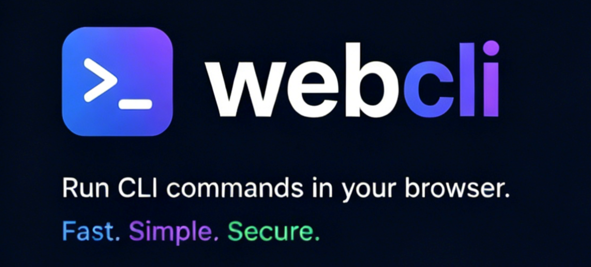

# webcli

`webcli` 是一个基于 Python + Chrome Extension 的浏览器桥接命令行工具。它让人类用户和 agent 都可以通过终端控制真实的 Chrome 浏览器。

> 说明：本项目基于 [jackwener/OpenCLI](https://github.com/jackwener/OpenCLI) 改编，并结合当前仓库的 Python CLI、bridge、Chrome extension 和 skill 结构做了重构与调整。

核心组成包括：

- `webcli browser ...` 命令
- 本地 `bridge server`
- 通过 WebSocket 连接的 Chrome 扩展
- 可复用的命名会话
- 自动写入 `record/<session>/` 的交互记录
- 提供给 agent 的 `skills/webcli/` 技能说明

## 能做什么

- 打开网页：`open`、`back`
- 查看页面：`state`、`find`、`get title/url/text/value/attributes/html`、`extract`、`frames`
- 页面交互：`click`、`type`、`fill`、`select`、`keys`、`wait`、`scroll`、`hover`、`focus`、`dblclick`、`check`、`uncheck`
- 标签页管理：`tab list/new/select/close`
- 调试能力：`console`、`analyze`、`network`、`eval`、`cdp`
- 浏览器控制：`bind`、`unbind`、`close`、`screenshot`、`cookies`

## 最快开始

如果你想最快用起来，推荐直接按下面的顺序操作：

### 1. 从 GitHub 克隆项目

```bash
git clone https://github.com/wz289494/webcli.git
cd webcli
```

### 2. 在项目根目录安装

如果你已经把项目拉到本地，最快的安装方式就是在项目根目录执行：

```bash
pipx install .
```

## 安装浏览器扩展

`webcli` 命令安装完成后，还需要把本仓库里的 `extension/` 加载到 Chrome 中。

### 重要说明

- 当前扩展是本地解压模式
- Chrome 不允许普通本地命令静默安装未上架扩展
- 所以扩展不能像 Python 包那样完全一键安装
- 当前最快方式是先用一条命令打开扩展页，再手动加载 `extension/`

### macOS

1. 启动 bridge

```bash
webcli bridge serve
```

1. 打开扩展页

```bash
open -a "Google Chrome" "chrome://extensions"
```

1. 在 Chrome 中操作

```text
打开开发者模式
点击“加载已解压的扩展程序”
选择当前项目里的 extension/ 目录
```

### Windows

1. 启动 bridge

```powershell
webcli bridge serve
```

1. 打开扩展页

```powershell
start chrome "chrome://extensions"
```

1. 在 Chrome 中操作

```text
打开开发者模式
点击“加载已解压的扩展程序”
选择当前项目里的 extension\ 目录
```

## 安装 skill

仓库中已经提供了 agent 可用的 skill：

```text
skills/webcli/
├─ SKILL.md
```

这个 skill 的作用是告诉 agent 如何使用当前项目里的 `webcli` 命令、bridge、extension 和 `record/` 记录。

### 本地引用方式

如果你的 agent 支持从本地目录加载 skill，直接把下面这个目录加入 agent 的 skills 目录即可：

```text
skills/webcli/
```

### 单独复制方式

如果你的 agent 需要把 skill 放到独立目录中，可以复制这个目录：

```text
复制 skills/webcli/ 到你的 agent skills 目录
```

### skill 使用前提

在 agent 真正调用这个 skill 之前，仍然需要先准备好：

1. `webcli` 已安装
2. `webcli bridge serve` 已启动
3. Chrome 已加载 `extension/`
4. 扩展已连接到 `ws://127.0.0.1:8765`

## 记录文件

每次命令和结果都会自动保存：

```text
record/<session>/*.md
```

示例：

```text
record/demo/20260527-173029-018836-navigate-cmd_xxx.md
```

## 本地开发

```bash
python3 -m venv .venv
source .venv/bin/activate
pip install -e ".[dev]"
```

## 项目结构

```text
webcli/
├─ README.md
├─ LICENSE
├─ pyproject.toml
├─ docx/
│  └─ logo.png
├─ extension/
├─ record/
├─ skills/
│  └─ webcli/
│     └─ SKILL.md
└─ src/
   ├─ webcli_main.py
   ├─ main.py
   ├─ browser_actions.py
   ├─ browser_js.py
   ├─ browser_runner.py
   ├─ protocol.py
   ├─ bridege/
   └─ browser_cli/
```
